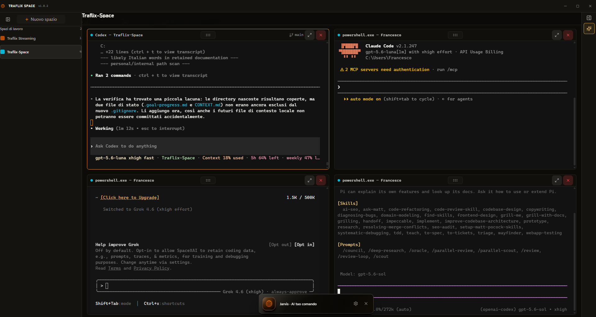

<h1 align="center">Traflix Space</h1>

<p align="center">
  <strong>The Windows workspace for projects, terminals, and coding agents.</strong><br/>
  Run local agent CLIs side-by-side, keep their terminal sessions organized,
  and work across projects without losing your place.
</p>

<p align="center">
  
  
  
  
</p>

<p align="center">
  <a href="docs/README.md">Documentation</a> ·
  <a href="SECURITY.md">Security</a> ·
  <a href="LICENSE">MIT License</a>
</p>

<p align="center">
  
</p>

## What it is

Traflix Space is a Windows desktop environment for developers who use local
terminal-based tools and coding agents. Each workspace is connected to a local
project directory and can host up to eight persistent terminal panes.

The interface is designed to keep the context around an agent session visible:
the project, terminal output, agent activity, file operations, and optional
voice interaction stay in one place.

## Features

<table>
<tr>
<td width="50%" valign="top">

### Workspace-first workflow

Switch between local projects while preserving their terminal processes,
selection state, layout, and scrollback.

</td>
<td width="50%" valign="top">

### Multi-pane terminals

Run several Windows ConPTY sessions in resizable layouts with bounded output,
scrollback restoration, and explicit lifecycle controls.

</td>
</tr>
<tr>
<td width="50%" valign="top">

### Agent-ready by default

Launch supported coding agents in visible terminal sessions, track completion
events, and keep notifications bound to the correct workspace and PTY.

</td>
<td width="50%" valign="top">

### Jarvis and Codex App Server

Use workspace-scoped context, read-only dynamic tools, conversational plans,
streaming responses, and optional voice input/output through the Rust backend.

</td>
</tr>
<tr>
<td width="50%" valign="top">

### Project and Git workflows

Browse project files, preview supported content, inspect Git changes, and keep
file operations bounded to the selected workspace.

</td>
<td width="50%" valign="top">

### Native Windows integration

Use clipboard and drag-and-drop support, a system tray in release builds, and
Windows-native process handling from a single desktop application.

</td>
</tr>
</table>

## Supported agents

Traflix Space includes launch definitions for:

**Anti-Gravity · Claude · Claudex · Codex · Command Code · Cline · Freebuff ·
Grok · OpenCode · Pi**

Any other command-line tool that runs in a Windows terminal can also be used
through a regular terminal pane.

## Install from source

Traflix Space is currently distributed as a source-built Windows application.

### Requirements

- Windows 10 or Windows 11;
- Node.js 24 and npm;
- a stable Rust toolchain with Cargo;
- Microsoft Edge WebView2 Runtime;
- Python 3.12 when building the optional Edge TTS helper;
- an installed and authenticated Codex CLI when using Jarvis through Codex App
  Server.

### Development

```powershell
git clone https://github.com/iTzFrancesco/Traflix-Space.git
cd Traflix-Space
npm ci
npm run tauri dev
```

The optional Groq voice provider can be configured in the application settings.
For local development, copy `.env.example` to `.env` and add your own
credential. Never commit `.env` or place a real key in documentation, tests, or
source control.

### Build and test

```powershell
npm run build
npm run tauri build
```

The Windows build hook creates and validates the Edge TTS sidecar at build
time. The generated executable is intentionally ignored and is not part of the
source distribution.

Run the main regression suites with:

```powershell
npm run test:strict
npm run test:jarvis
npm run test:terminal
npm run test:agent-notifications
```

## Privacy and credentials

Traflix Space is a local desktop application. Workspace metadata and UI state
are stored in the operating system's application-data area, while project
files are accessed only through explicit user actions or bounded host
operations.

Voice features are optional. When Groq Speech-to-Text is enabled, audio is sent
to Groq and its provider terms apply. Credentials are handled by the Rust
backend and are not exposed to React state or ordinary terminal child
processes. Jarvis does not copy or persist Codex OAuth tokens; authentication
remains owned by the official Codex runtime.

Treat project files, terminal output, agent messages, and remote web content as
untrusted input. Review the [security policy](SECURITY.md) before sharing logs,
opening issues, or publishing a previously private repository.

## Documentation and development

- [Documentation index](docs/README.md)
- [Contributor and agent guide](AGENTS.md)
- [Agent notification adapters](scripts/agent-notifications/README.md)
- [Security policy](SECURITY.md)

Bug reports and pull requests are welcome. Please remove credentials, personal
filesystem paths, transcripts, and private project content before submitting
diagnostic material.

## License

Traflix Space is free and open source under the [MIT License](LICENSE). This
license covers the project's original code and documentation. Third-party
libraries, models, services, trademarks, and generated dependencies remain
subject to their own licenses and terms.
